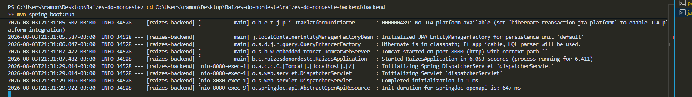
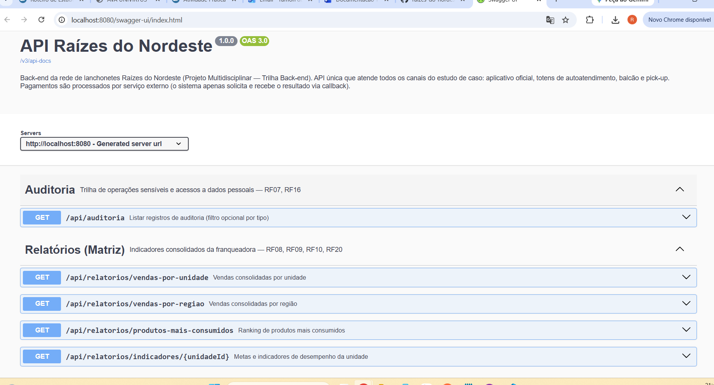
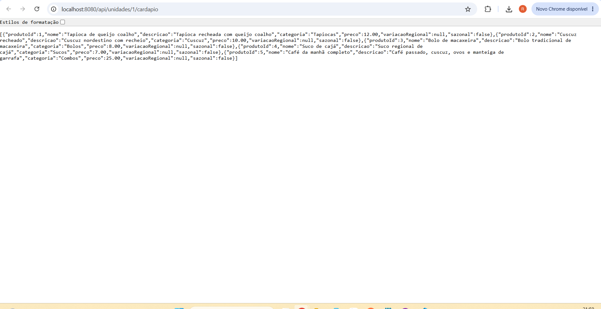

# Anexos — Evidências de Execução

## Aplicação em execução

Terminal com a API iniciada pelo comando `mvn spring-boot:run` (mensagem
"Started RaizesApplication" e Tomcat na porta 8080):

## Swagger UI

Com a API rodando, a documentação interativa fica disponível em
`http://localhost:8080/swagger-ui.html`:

## Exemplo de requisição

Consulta do cardápio da unidade 1 no navegador (`GET /api/unidades/1/cardapio`), retornando
os produtos disponíveis na unidade:

