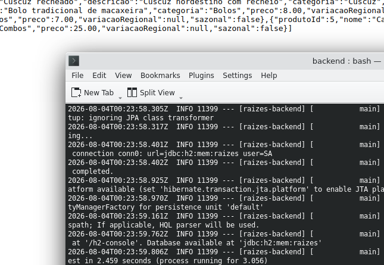

# Anexos — Evidências de Execução

## Testes automatizados (mvn test)

Execução dos 12 testes automatizados do projeto, todos passando:

## Swagger UI

API em execução local (`mvn spring-boot:run`), com a documentação interativa disponível em
`http://localhost:8080/swagger-ui.html`:

## Exemplo de requisição

Consulta do cardápio da unidade 1 no navegador (`GET /api/unidades/1/cardapio`), retornando
os produtos disponíveis na unidade:

